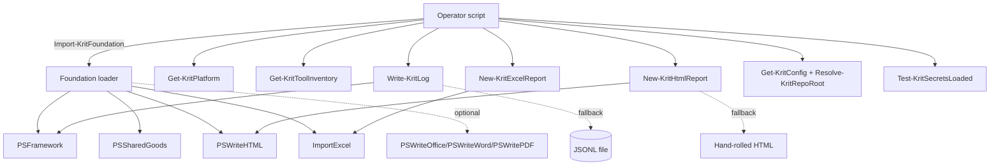

# Krit.OmniFramework — Architecture

Author: Joshua Finley — Kritical Pty Ltd

## Shape

## Layers

| Layer | Files | Role |
|---|---|---|
| Public | `src/Public/*.ps1` | Operator entry points. Comment-based help. Banner-emitting. |
| Private | `src/Private/*.ps1` | Internal helpers. Not exported. Currently just `_Banner.ps1`. |
| Manifest | `src/Krit.OmniFramework.psd1` | Author=Joshua Finley, RequiredModules pin floors. |
| Assets | `src/Assets/kritical-logo.txt` | Bundled brand banner fallback. |
| Tests | `tests/Unit/` | Pester unit suite (17 tests). |

## Design choices

- **No reinventing OSS** — every reporting / logging / Excel path is the genuine community module. The Kritical value is the *foundation orchestration* + the brand layer + the multi-OS primitives.
- **PSSharedGoods over psutil** — eliminates the namespace ambiguity. Documented in README.
- **FHS/LSB-aware tool inventory** — not just `Get-Command`. We walk the actual standard paths per OS so duplicates surface and dotnet/scoop/winget shims are visible.
- **Banner asset triple-resolution** — `Kritical-Branding\public\KriticalLogo.txt` (canonical) → legacy `Github-SecretsOutsideOfGitRepos\KriticalLogo.txt` → bundled `src/Assets/kritical-logo.txt`. Brand renders on a fresh PSGallery install even on a non-Kritical machine.
- **No `Claude` / `Hermes` / `Codex` / `Copilot` strings** in operator-facing output. Authorship visible: Joshua Finley, Kritical Pty Ltd.
- **PSFramework optional** — `Write-KritLog` doesn't throw when PSFramework isn't loaded; it falls back to plain JSONL. Lets supervisor / CI scripts use the same logger primitive without forcing the dep.
- **PSWriteHTML optional** — `New-KritHtmlReport` ditto: falls back to a minimal hand-rolled HTML when PSWriteHTML isn't installed.

## Adding a new public function

1. Drop file in `src/Public/<Verb-KritThing>.ps1` with comment-based help + `.NOTES Author: Joshua Finley - Kritical Pty Ltd`.
2. Add the function name to `FunctionsToExport` in `Krit.OmniFramework.psd1`.
3. Add a Pester test under `tests/Unit/<Thing>.Tests.ps1`.
4. Update README "Exported functions" table + USAGE.md.
5. Run `tests\Invoke-AllTests.ps1` until green.
6. Bump `ModuleVersion` per semver, add `ReleaseNotes`, publish.
